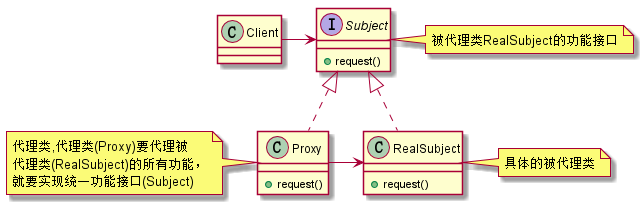

# Proxy Pattern 代理模式

**定义**：为对象提供一种代理，以控制对这个对象的访问。

**生活案例**:  
1. 租房中介,  
    执行者：中介   
    被代理人：我  
    这房子必须找，但是自己找麻烦，所以委托中介
    需要将你将租房的要求告诉中介  
2. 黄牛,  
    执行者：黄牛  
    被代理人：我  
    这票必须买，但是买不到，只有找黄牛  
    你需要什么票需要告诉黄牛
3. 媒人,  
    执行者：媒婆 被代理人：我  
    这媳妇必须找，但是自己找不到/没空找  
    你要找什么类型的妹子，你需要告诉媒婆  

**满足代理模式应用场景的三个必要条件**：
1. 有两个主要角色：执行者、被代理人
2. **注重过程**，对于被代理对象来说，这件事一定要做的，但是自己不想做或者没时间做，找代理
3. 代理对象需要获取被代理对象的个人资料（执行者持有被代理对象的引用）


## 分类
代理模式分为两种： 
1. 静态代理
2. 动态代理

其中动态代理又分为，`jdk动态代理`和`cglib动态代理`

## 静态代理

uml: [statics](uml/proxy.puml)



> 简单点来说，就是RealSubject类想要为Client类提供一些功能，但是RealSubject类又不能暴露自己的存在，
> 所以，委托代理Proxy类，让Proxy类调用RealSubject类的功能，从而让Client类间接使用RealSubject类的功能。  
> 这样，代理中介就会将客户端与委托类隔离，还可以增加一些其他的功能。

哈哈，设计模式之禅以及大话设计模式都举了一个有趣的例子，其中设计模式之禅中的例子记忆尤为深刻：
> 西门庆找潘金莲，那潘金莲不好意思答复呀，咋办，找那个王婆做代理

## 动态代理

根本： 字节码重组
jdk动态代理： 生成java，通过compiler生成字节码
cglib：直接通过asm.jar 修改字节码

### JDK动态代理
jdk动态代理主要涉及两个类：
1. `java.lang.reflect.InvocationHandler`
2. `java.lang.reflect.Proxy`。

使用参见代码： `me.feathers.proxy.dynamic`

**jdk动态代理原理**:

```java
Proxy.newProxyInstance(cl, subject.getClass().getInterfaces(), handler);
```

1. 拿到被代理对象的引用，获取他的接口
2. jdk代理重新生成一个类，同时实现被代理对象实现的接口
3. 获取被代理对象的引用
4. 动态生成一个新的class 

生成的新的class中，继承 `Proxy`类（获取代理类的class文件方法请查看`me.feathers.proxy.dynamic.jdk.Test`），并且持有 `InvocationHandler` 的引用：

```java
// 代理类的request 方法，实际是调用h的request方法，这里的h就是InvocationHandler
// 从而实现对Subject对象的代理
// 需要被代理对象的接口是为了确认生成对象的功能，可以强转为目标接口实例

public final class $Proxy0 extends Proxy implements Subject {
   static {
       try {
         m3 = Class.forName("com.sun.proxy.$Proxy0").getMethod("request", new Class[0]);
         return;
       } catch(xxx){xxx}
   }
   
   public final void request() {
       try {
         this.h.invoke(this, m3, null);
         return;
       } catch (Error|RuntimeException localError) {
         throw localError;
       } catch (Throwable localThrowable) {
         throw new UndeclaredThrowableException(localThrowable);
       }
   } 
}
```


### 手动实现动态代理

code: `me.feathers.proxy.dynamic.custom`

### cglib动态代理

code: `me.feathers.proxy.dynamic.cglib`

jdk动态代理必须实现一个接口，在灵活性上就可能有些损失，cglib动态代理不同于jdk动态代理，生成的代理对象继承被代理对象。  

我们通过操作子类，间接操作父类，从而实现代理。
